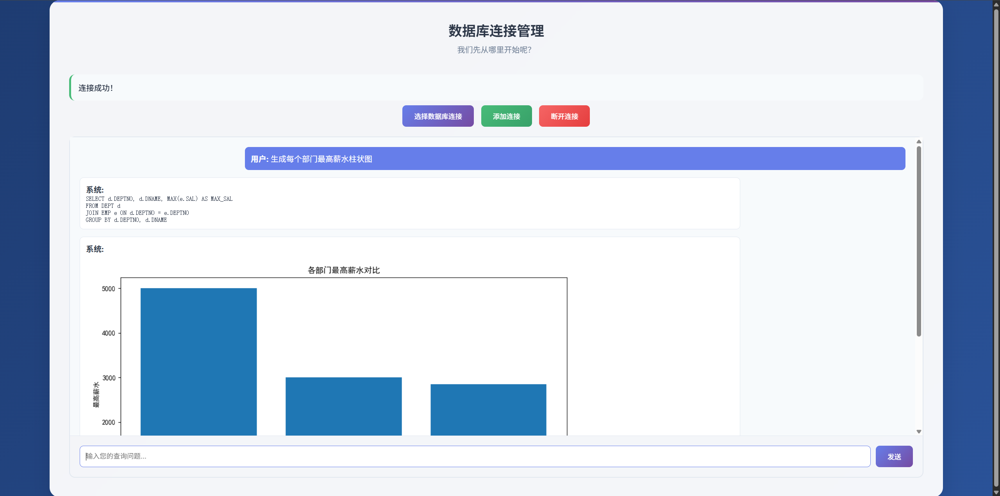

#### 项目简介：

本项目基于 Spring AI 与本地部署的 deepseek-r1:8b，开发了一个支持自然语言查询数据库并自动生成统计图表的 AI Agent，实现一句话生成 SQL、执行并返回可视化结果（含执行 SQL 与 base64 编码图片），显著提升数据统计效率。

#### 项目亮点：

- 端到端自动化：将自然语言查询自动转换为 SQL和可执行脚本，生成可视化结果，减少人工干预；
- 可审计输出：前端同时返回并显示所执行的 SQL，保证查询可复核与安全性；
- 多数据库支持：通过 JDBC 无缝支持 MySQL / Oracle / SQL Server(还未测试)，并获取完整表结构信息作为Prompt的一部分；
- 可视化交付：通过进程调用 Python 生成图表并以 base64 返回，兼容前端即时渲染。


#### 界面如下


#### 保存连接的表结构
```sql
create table tb_mysql_conn
(
    id            int auto_increment
        primary key,
    type          enum ('MYSQL', 'POSTGRES', 'ORACLE', 'SQLSERVER') default 'MYSQL' not null comment '数据库类型',
    username      varchar(100)                                                      not null comment '登录用户名',
    password      varchar(100)                                                      not null comment '登录密码（建议加密存储）',
    host          varchar(255)                                                      not null comment '数据库主机地址或 IP',
    port          int unsigned                                      default '3306'  not null comment '端口号，MySQL 默认 3306',
    database_name varchar(100)                                                      not null comment '数据库名称',
    constraint uk_connection
        unique (type, host, port, database_name, username)
)
    comment 'mysql数据库' collate = utf8mb4_unicode_ci;

create table tb_oracle_conn
(
    id           int auto_increment
        primary key,
    type         enum ('MYSQL', 'POSTGRES', 'ORACLE', 'SQLSERVER') default 'ORACLE' not null comment '数据库类型',
    username     varchar(100)                                                       not null comment '登录用户名',
    password     varchar(100)                                                       not null comment '登录密码',
    host         varchar(255)                                                       not null comment '数据库主机地址或 IP',
    port         int unsigned                                      default '1521'   not null comment '端口号，Oracle 默认 1521',
    service_name varchar(100)                                                       not null comment '数据库名称',
    constraint uk_connection
        unique (type, host, port, service_name, username)
)
    comment 'oracle数据库' collate = utf8mb4_unicode_ci;

create table tb_sqlserver_conn
(
    id            int auto_increment
        primary key,
    type          enum ('MYSQL', 'POSTGRES', 'ORACLE', 'SQLSERVER') default 'SQLSERVER' not null comment '数据库类型',
    username      varchar(100)                                                          not null comment '登录用户名',
    password      varchar(100)                                                          not null comment '登录密码（建议加密存储）',
    host          varchar(255)                                                          not null comment '数据库主机地址或 IP',
    port          int unsigned                                      default '1433'      not null comment '端口号，sqlserver 默认 1433',
    database_name varchar(100)                                                          not null comment '数据库名称',
    schema_name   varchar(50)                                       default 'dbo'       null,
    constraint uk_connection
        unique (type, host, port, database_name, username, schema_name)
)
    comment 'sqlserver数据库' collate = utf8mb4_unicode_ci;


```